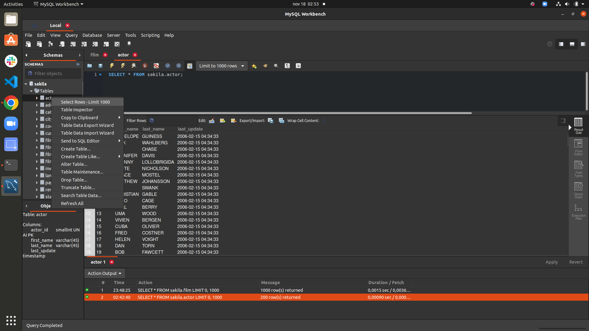
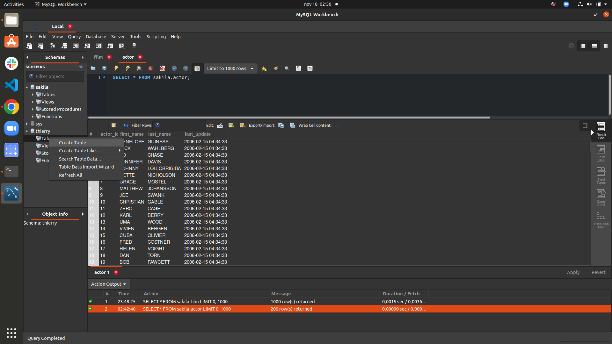
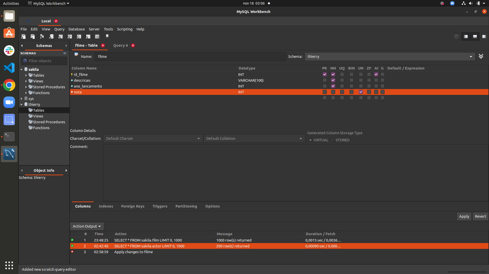
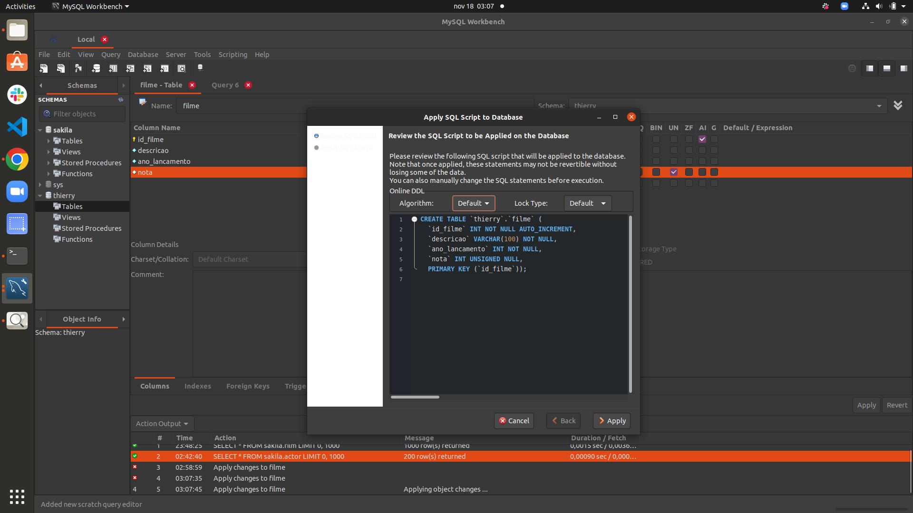
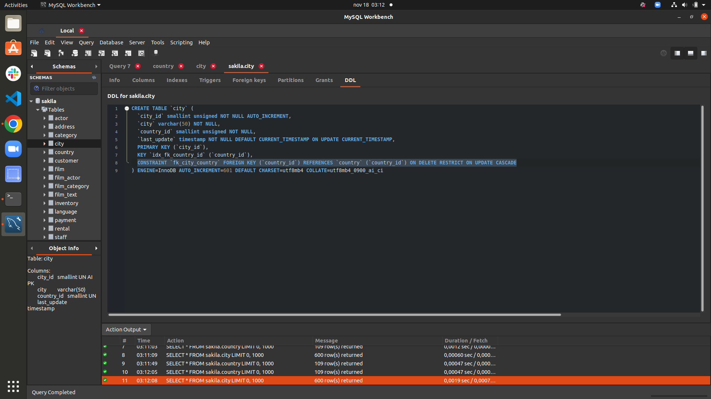

## Exercício 1: Descubra como fazer uma pesquisa em qualquer tabela sem utilizar uma linha de código usando o MySql Workbench.

## Exercício 2: Descubra como é possível criar uma tabela sem usar código SQL usando o MySql Workbench.

## Exercício 3: Feito isso, crie uma tabela com as seguintes restrições:

Nome da tabela: filme

Colunas:

filme_id - primary key, tipo int, incrementa por 1 cada vez que um valor é inserido automaticamente;
descricao - não permite nulos, tipo texto (varchar(100));
ano_lancamento - não permite nulos, tipo int;
nota - permite nulos, tipo int;

## Exercício 4: Analise a tabela city e encontre a tabela à qual a coluna country_id faz referência.

## Exercício 5: Após resolver o exercício anterior, responda: qual tipo de relacionamento a tabela city faz com a tabela country?

N:1

## Exercício 6: Qual tipo de relacionamento a tabela country faz com a tabela city?

1:N
