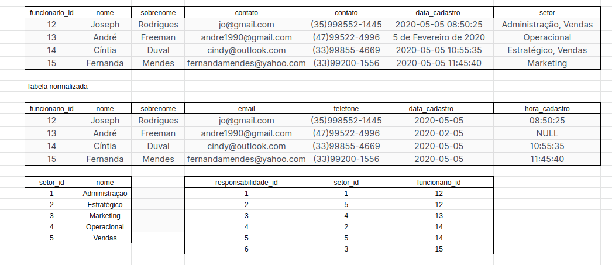
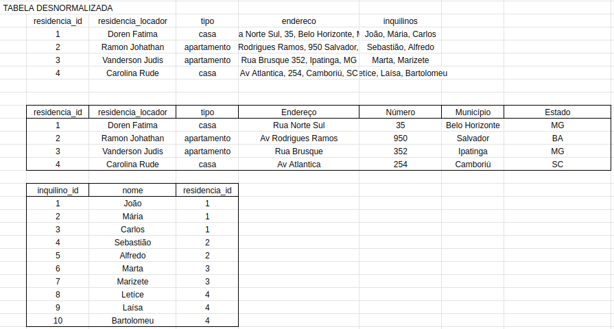
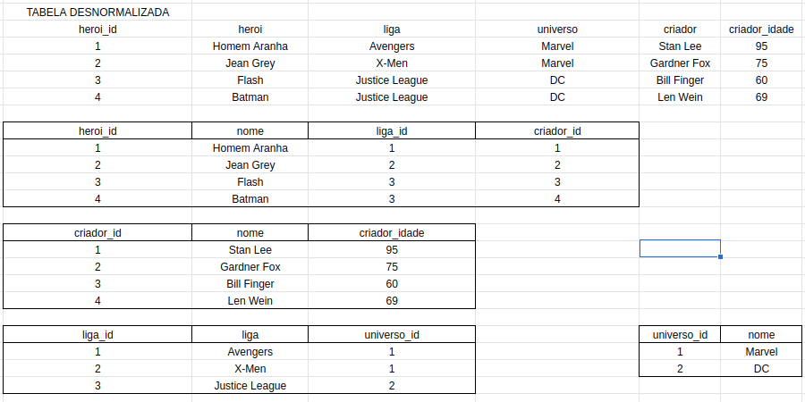
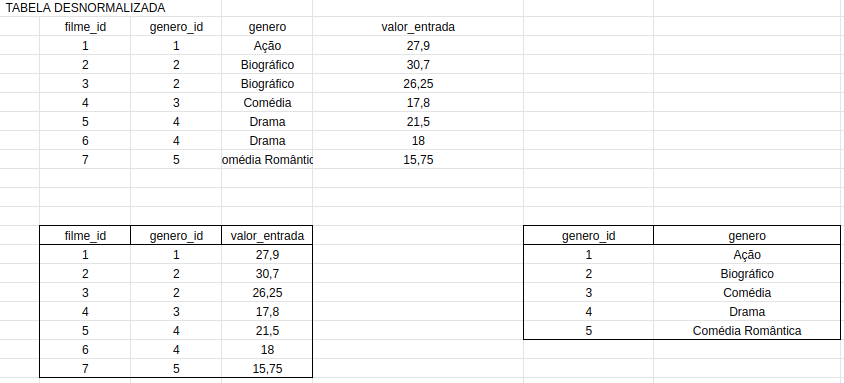

## 1)Normalize a tabela
 

 

## 2)Crie o banco de dados chamado normalization com os dados do exercicio anterior
 

## 3)Crie o banco de dados chamado zoologico com a seguinte lógica
 
Cada animal também possui vários cuidadores, e cada cuidador pode ser responsável por mais de um animal. Além disso, cada cuidador possui um gerente, sendo que cada gerente pode ser responsável por mais de um cuidador.

Animal n - n cuidadores

cuidadores n - 1 gerente

## 4:🚀Converta a tabela desnormalizada para a 1ª Forma Normal.
 

## 5:🚀Converta a tabela desnormalizada para a 2ª Forma Normal.
 

## 6:🚀Converta a tabela desnormalizada para a 3ª Forma Normal.
 

