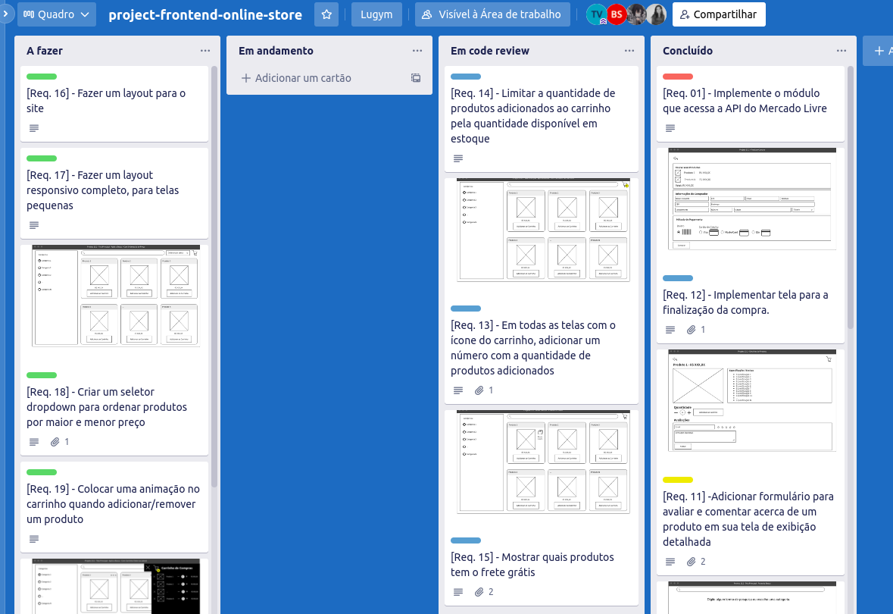

# Metodologias Ágeis 

## Ágil = Ciclos menores de entrega

É um método de gestão de projetos com o objetivo de permitir a entrega rápida e de alta qualidade do produto. É uma filosofia que acaba por incentivar o maior trabalho em equipe, auto-organização, a comunicação frequente, foco no cliente e a entrega de valor.

# Pilares do Manifesto Ágil:

```
1- Indíviduos e interações > processos e ferramentas;

2- Software em funcionamento > documentação abrangente;

3- Colaboração com o cliente > negociação de contratos;

4- Responder a mudanças > seguir o plano;
```

# SCRUM

As equipes são divididas em: Product Owner, Scrum Master e desenvolvedores.

O tabalho e dividido em ciclos chamados de Sprints. O Sprint é um intervalo de tempo onde um determinado conjunto de atividades deve ser executado, normalmente intervalos de 2 a 4 semanas. Tabalhando em ciclos mais curtos com feedbacks constantes se torna mais simples aplicar mudanças trazendo assim um produto de maior qualidade.

No Scrum existem as Daily meetings que são reuniões curtas para manter todos da equipe em dia sobre o trabalho. 
Os assuntos são: O que você fez ontem, o que fará hoje e se houve algum imprevisto.


# KANBAN

É um fluxo de trabalho de forma visual no formato de linhas e colunas. Mantendo todos da equipe em sintonia sobre os estágios do projeto.


